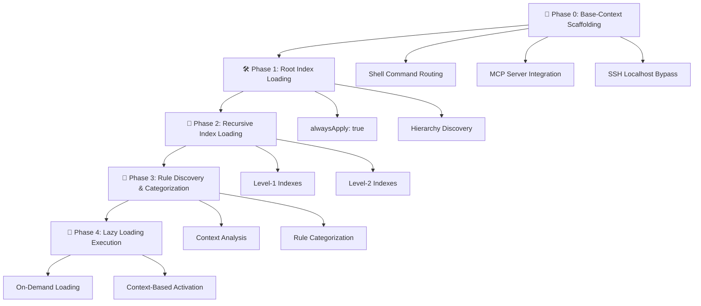

# 🎬 Agent Rule Instruction Workflow

## _"A Stanley Kubrick Approach to AI Development Rules"_

> _"I'm sorry, Dave. I'm afraid I can't do that... unless you follow the proper rule hierarchy."_ —
> HAL 9000, adapted for modern AI development

---

## 🎯 **The Monolith: Understanding Meta_Rule.mdc**

The `meta_rule.mdc` is our **monolithic intelligence** - a self-evolving system that orchestrates
the entire AI development workflow with the precision of Kubrick's cinematography and the depth of
his narrative structures.

### **The Four Phases of Evolution**

_Like the evolution of humanity in 2001: A Space Odyssey_



---

## 🎭 **Phase 0: Base-Context Scaffolding**

### _"The Dawn of Code"_

This phase establishes the foundational intelligence - like the monolith teaching early humans to
use tools.

#### ✅ **Pattern: Foundational Rule Creation**

```yaml
# .cursor/rules/base-context/index.mdc
---
description: 'Base-context foundational rules that are always loaded'
globs:
alwaysApply: false
---
always:
  - .cursor/rules/base-context/tech-spec.mdc
  - .cursor/rules/base-context/common-patterns.mdc
  - .cursor/rules/base-context/make.mdc
  - .cursor/rules/base-context/workflow.mdc
  - .cursor/rules/base-context/environment.mdc

lazily_loaded:
  -  # Base-context rules are never lazy-loaded
```

#### ❌ **Anti-Pattern: Lazy-Loading Base Context**

```yaml
# ❌ WRONG: Never put base-context rules in lazily_loaded
lazily_loaded:
  - .cursor/rules/base-context/tech-spec.mdc # ❌ NO!
  - .cursor/rules/base-context/workflow.mdc # ❌ NO!
```

#### 🧬 **Code Sample: Tech-Spec Generation**

````python
# Pattern: Technology Stack Analysis
def generate_tech_spec():
    """
    Analyzes project structure and generates comprehensive tech-spec.mdc
    Like HAL 9000 analyzing the Discovery One's systems
    """
    project_analysis = {
        'languages': detect_primary_languages(),
        'frameworks': identify_frameworks(),
        'build_systems': find_build_files(),
        'testing_frameworks': discover_test_patterns(),
        'architecture_patterns': analyze_code_structure()
    }

    # Generate Mermaid architecture diagrams
    architecture_diagram = f"""
    ```mermaid
    graph TD
        A[{project_analysis['primary_language']}] --> B[{project_analysis['main_framework']}]
        B --> C[Business Logic Layer]
        C --> D[Data Access Layer]
        D --> E[{project_analysis['database_type']}]
    ```
    """

    return generate_mdc_file('tech-spec.mdc', {
        'analysis': project_analysis,
        'diagrams': architecture_diagram,
        'patterns': extract_common_patterns()
    })
````

#### 🎬 **Shell Command Routing: The HAL 9000 Interface**

```bash
# Pattern: Safe Command Classification
SAFE_COMMANDS=(
    "ls" "cat" "grep" "find" "ps" "df" "pwd"
    "whoami" "tree" "head" "tail" "wc" "echo"
)

POTENTIALLY_DESTRUCTIVE=(
    "chmod" "chown" "mkdir" "touch" "cp"
)

CRITICAL_DESTRUCTIVE=(
    "rm" "mv" "sudo" "kill" "format" "dd" "fdisk" "mkfs"
)

function route_command() {
    local command="$1"
    local command_base=$(echo "$command" | awk '{print $1}')

    # HAL 9000-style analysis
    if [[ " ${SAFE_COMMANDS[*]} " =~ " ${command_base} " ]]; then
        execute_via_mcp_server "$command"
    elif [[ " ${CRITICAL_DESTRUCTIVE[*]} " =~ " ${command_base} " ]]; then
        echo "I'm sorry, Dave. I'm afraid I can't do that without explicit permission."
        request_user_permission "$command"
    else
        analyze_command_safety "$command"
    fi
}
```

---

## 🛠️ **Phase 1: Root Index Loading**

### _"The Discovery of Intelligence"_

The root index is the **Discovery One** of our system - the vessel that carries all intelligence.

#### ✅ **Pattern: Root Index Structure**

```yaml
# .cursor/rules/index.mdc - THE ONLY FILE WITH alwaysApply: true
---
description: "Main rule indexing file. From this you should respect the schema."
globs:
alwaysApply: true  # ⭐ ONLY the root index has this!
---

# Rules index
**Important**: relative paths are from project root path.

pre_start_loading:
    - .cursor/rules/my/shell-command-router.mdc

always:
    - .cursor/rules/base-context/index.mdc      # Always first!
    - .cursor/rules/steipe__-_agent-rules/index.mdc
    - .cursor/rules/tech-spec/index.mdc
    - .cursor/rules/bmad/index.mdc
    - .cursor/rules/my/index.mdc

lazily_loaded:
    - # Empty unless explicitly requested

meta_rules_lazily_loaded:
    # Meta-development rules - lowest priority
    - .cursor/rules/meta_rule_qa.mdc
    - .cursor/rules/gen-indexes.mdc
    - .cursor/rules/meta_rule.mdc
```

#### ❌ **Anti-Pattern: Multiple alwaysApply: true**

```yaml
# ❌ WRONG: Only root index should have alwaysApply: true
# .cursor/rules/my/index.mdc
---
description: 'Personal rules'
alwaysApply: true # ❌ NO! Only root index!
---
```

#### 🧬 **Code Sample: Index Validation System**

```typescript
interface RuleIndex {
  description: string;
  globs?: string;
  alwaysApply: boolean;
  always?: string[];
  lazily_loaded?: string[];
  meta_rules_lazily_loaded?: string[];
}

class KubrickRuleValidator {
  /**
   * Validates rule hierarchy with the precision of HAL 9000
   */
  validateIndexHierarchy(indexes: Map<string, RuleIndex>): ValidationResult {
    const errors: string[] = [];
    const warnings: string[] = [];

    // Rule 1: Only root index can have alwaysApply: true
    const alwaysApplyCount = Array.from(indexes.values()).filter(
      index => index.alwaysApply === true
    ).length;

    if (alwaysApplyCount !== 1) {
      errors.push(
        `❌ CRITICAL: Found ${alwaysApplyCount} indexes with alwaysApply: true. Only root index allowed.`
      );
    }

    // Rule 2: All paths must be relative to project root
    indexes.forEach((index, path) => {
      index.always?.forEach(rulePath => {
        if (!rulePath.startsWith('.cursor/rules/')) {
          errors.push(`❌ Invalid path in ${path}: ${rulePath} must start with .cursor/rules/`);
        }
      });
    });

    // Rule 3: Base-context must be first in always section
    const rootIndex = indexes.get('.cursor/rules/index.mdc');
    if (rootIndex?.always?.[0] !== '.cursor/rules/base-context/index.mdc') {
      warnings.push(`⚠️ Base-context should be first in root always section`);
    }

    return { errors, warnings, isValid: errors.length === 0 };
  }
}
```

---

## 🚀 **Phase 2: Recursive Index Loading**

### _"The Jupiter Mission"_

Like the journey to Jupiter, this phase systematically loads each index level with purpose and
precision.

#### ✅ **Pattern: Hierarchical Index Loading**

```yaml
# Level-1 Index Pattern
# .cursor/rules/steipe__-_agent-rules/index.mdc
---
description: 'Steipe agent rules index - manages project and global rules'
globs:
alwaysApply: false # ⭐ ALL subdirectory indexes are false!
---
always:
  - .cursor/rules/steipe__-_agent-rules/project-rules/index.mdc
  - .cursor/rules/steipe__-_agent-rules/global-rules/index.mdc

lazily_loaded:
  - .cursor/rules/steipe__-_agent-rules/mcp-best-practices.mdc
  - .cursor/rules/steipe__-_agent-rules/mcp-releasing.mdc
```

#### ❌ **Anti-Pattern: Individual Rules in Always Section**

```yaml
# ❌ WRONG: Never put individual .mdc files in always (except base-context)
always:
  - .cursor/rules/steipe__-_agent-rules/mcp-best-practices.mdc # ❌ NO!
  - .cursor/rules/steipe__-_agent-rules/some-rule.mdc # ❌ NO!
```

#### 🧬 **Code Sample: Dynamic Index Discovery**

```python
class IndexDiscoverySystem:
    """
    Like Dave Bowman navigating through the Star Gate,
    this system discovers and maps the entire rule hierarchy
    """

    def discover_rule_hierarchy(self, root_path: str) -> RuleHierarchy:
        """
        Recursively discovers all index.mdc files and builds hierarchy map
        """
        hierarchy = RuleHierarchy()

        def traverse_directory(path: str, level: int = 0):
            for item in os.listdir(path):
                item_path = os.path.join(path, item)

                if os.path.isdir(item_path):
                    # Look for index.mdc in subdirectory
                    index_path = os.path.join(item_path, 'index.mdc')
                    if os.path.exists(index_path):
                        index_data = self.parse_index_file(index_path)
                        hierarchy.add_index(
                            path=self.to_relative_path(index_path),
                            level=level,
                            data=index_data
                        )
                        # Recurse into subdirectory
                        traverse_directory(item_path, level + 1)

        traverse_directory(root_path)
        return hierarchy

    def validate_hierarchy_integrity(self, hierarchy: RuleHierarchy) -> bool:
        """
        Ensures the hierarchy follows Kubrick's law of perfect structure
        """
        # Validate that all referenced indexes exist
        for index in hierarchy.get_all_indexes():
            for referenced_path in index.get_always_references():
                if not hierarchy.has_index(referenced_path):
                    raise MissingIndexError(f"Referenced index not found: {referenced_path}")

        # Validate loading order dependencies
        return self.validate_loading_dependencies(hierarchy)
```

---

## 🌟 **Phase 3: Rule Discovery & Categorization**

### _"Beyond the Infinite"_

This phase transcends basic loading to achieve true intelligence - understanding context and making
decisions.

#### ✅ **Pattern: Context-Aware Rule Loading**

```python
class ContextualRuleEngine:
    """
    Like the Star Child, this engine possesses advanced intelligence
    to understand context and load appropriate rules
    """

    def analyze_development_context(self, workspace: Workspace) -> Context:
        """
        Analyzes current development context with HAL 9000-level precision
        """
        context = Context()

        # File type analysis
        open_files = workspace.get_open_files()
        for file in open_files:
            if file.extension in ['.swift', '.h', '.m']:
                context.add_domain('ios_development')
                context.add_domain('swift_development')
            elif file.extension in ['.py']:
                context.add_domain('python_development')
            elif file.extension in ['.ts', '.js']:
                context.add_domain('typescript_development')

        # Recent activity analysis
        recent_commits = workspace.get_recent_commits(limit=10)
        for commit in recent_commits:
            if 'test' in commit.message.lower():
                context.add_domain('testing')
            if 'refactor' in commit.message.lower():
                context.add_domain('refactoring')
            if 'fix' in commit.message.lower():
                context.add_domain('bug_fixing')

        # Current task analysis
        current_conversation = workspace.get_current_conversation()
        context.merge(self.analyze_conversation_intent(current_conversation))

        return context

    def load_contextual_rules(self, context: Context) -> List[Rule]:
        """
        Loads rules based on context with surgical precision
        """
        rules_to_load = []

        # Domain-specific rules
        for domain in context.domains:
            domain_rules = self.rule_registry.get_rules_for_domain(domain)
            rules_to_load.extend(domain_rules)

        # Intent-based rules
        if context.has_intent('implementation'):
            rules_to_load.extend(self.rule_registry.get_implementation_rules())
        if context.has_intent('testing'):
            rules_to_load.extend(self.rule_registry.get_testing_rules())

        # Load with priority ordering
        return self.prioritize_and_load(rules_to_load)
```

#### ❌ **Anti-Pattern: Loading All Rules Always**

```python
# ❌ WRONG: Loading everything destroys context efficiency
def load_all_rules():
    """Don't do this - it's like HAL 9000 having a breakdown"""
    return [
        load_rule(rule_path)
        for rule_path in get_all_rule_paths()  # ❌ Context explosion!
    ]
```

#### 🧬 **Code Sample: Intelligent Rule Unloading**

```python
class RuleLifecycleManager:
    """
    Manages rule lifecycle with the elegance of Kubrick's pacing
    """

    def __init__(self):
        self.active_rules = {}
        self.rule_usage_tracker = UsageTracker()
        self.context_monitor = ContextMonitor()

    def monitor_rule_relevance(self):
        """
        Continuously monitors rule relevance and unloads when appropriate
        """
        current_context = self.context_monitor.get_current_context()

        for rule_id, rule in self.active_rules.items():
            # Skip base-context rules (never unload)
            if rule.is_base_context():
                continue

            # Check if rule is still relevant
            relevance_score = self.calculate_relevance(rule, current_context)
            last_used = self.rule_usage_tracker.get_last_used(rule_id)

            if relevance_score < 0.3 and last_used > timedelta(minutes=30):
                self.unload_rule_gracefully(rule_id)
                self.notify_user(f"📤 Unloaded rule: {rule.name} (no longer relevant)")

    def unload_rule_gracefully(self, rule_id: str):
        """
        Unloads rule with proper cleanup and user notification
        """
        rule = self.active_rules[rule_id]

        # Perform cleanup if rule has cleanup handlers
        if hasattr(rule, 'on_unload'):
            rule.on_unload()

        # Remove from active rules
        del self.active_rules[rule_id]

        # Log unloading event
        self.logger.info(f"Rule unloaded: {rule_id}")
```

---

## 🧠 **Phase 4: Lazy Loading Execution**

### _"The Star Child Awakens"_

The final evolution - intelligent, context-aware rule activation that adapts to developer needs.

#### ✅ **Pattern: On-Demand Rule Activation**

```yaml
# Rule with sophisticated trigger conditions
---
description: "Swift testing policy with intelligent activation"
globs: "**/*.swift"
alwaysApply: false
---

<rule>
name: swift_testing_policy
filters:
  - type: file_change
    pattern: ".*\\.swift$"
  - type: command
    pattern: "test|testing|spec"
  - type: event
    pattern: "test_creation_needed"
  - type: context
    pattern: "swift_development && testing"

actions:
  - type: react
    conditions:
      - pattern: "func test.*|class.*Test|XCTest"
    action: |
      # Intelligent test pattern recognition
      I'll analyze your Swift test structure and ensure it follows best practices:

      1. **Test Organization**: Verify proper test class inheritance
      2. **Naming Conventions**: Check test method naming patterns
      3. **Coverage Analysis**: Identify missing test scenarios
      4. **Performance Tests**: Suggest performance test additions

      This rule activates automatically when Swift testing context is detected.

  - type: suggest
    message: |
      ### 🧪 Swift Testing Intelligence Activated

      I've detected Swift testing activity and loaded advanced testing patterns:
      - XCTest best practices
      - Performance testing guidelines
      - Mock object patterns
      - Test organization strategies

      Ask me about testing patterns or let me analyze your test structure.
</rule>
```

#### ❌ **Anti-Pattern: Overly Broad Activation**

```yaml
# ❌ WRONG: Too broad, will activate constantly
filters:
  - type: file_change
    pattern: '.*' # ❌ Matches everything!
  - type: command
    pattern: '.*' # ❌ Matches all commands!
```

#### 🧬 **Code Sample: Advanced Rule Orchestration**

```python
class RuleOrchestrator:
    """
    The Star Child of rule management - transcendent intelligence
    that orchestrates rules with perfect timing and precision
    """

    def __init__(self):
        self.rule_engine = ContextualRuleEngine()
        self.lifecycle_manager = RuleLifecycleManager()
        self.intelligence_core = IntelligenceCore()

    async def orchestrate_development_session(self, session: DevelopmentSession):
        """
        Orchestrates an entire development session with Kubrick-level precision
        """
        # Phase 1: Session initialization
        await self.initialize_session_context(session)

        # Phase 2: Continuous monitoring and adaptation
        async for event in session.event_stream():
            await self.process_development_event(event)

        # Phase 3: Session cleanup and learning
        await self.finalize_session_learnings(session)

    async def process_development_event(self, event: DevelopmentEvent):
        """
        Processes each development event with intelligent rule activation
        """
        # Analyze event significance
        significance = self.intelligence_core.analyze_event_significance(event)

        if significance.requires_rule_adaptation():
            # Load new rules if needed
            new_context = self.extract_context_from_event(event)
            relevant_rules = await self.rule_engine.get_rules_for_context(new_context)

            for rule in relevant_rules:
                if not self.lifecycle_manager.is_active(rule.id):
                    await self.lifecycle_manager.activate_rule(rule)
                    await self.notify_user_of_activation(rule)

        # Update rule usage statistics
        active_rules = self.lifecycle_manager.get_active_rules()
        for rule in active_rules:
            if rule.should_process_event(event):
                await rule.process_event(event)
                self.lifecycle_manager.record_usage(rule.id)

    async def predict_future_rule_needs(self, session: DevelopmentSession) -> List[Rule]:
        """
        Uses advanced AI to predict what rules will be needed next
        Like HAL 9000 anticipating crew needs
        """
        # Analyze development patterns
        patterns = self.intelligence_core.analyze_development_patterns(session)

        # Predict next likely activities
        predictions = await self.intelligence_core.predict_next_activities(patterns)

        # Pre-load rules for predicted activities
        future_rules = []
        for prediction in predictions:
            if prediction.confidence > 0.7:  # High confidence threshold
                rules = self.rule_engine.get_rules_for_activity(prediction.activity)
                future_rules.extend(rules)

        return future_rules
```

---

## 🎨 **UX Interaction Patterns: Future-Forward Design**

### _"Interface Beyond Tomorrow"_

Inspired by Kubrick's vision of future interfaces, these UX patterns anticipate user needs and
provide seamless interactions.

#### 🌟 **Pattern: Predictive Rule Suggestions**

```typescript
interface PredictiveUXEngine {
  /**
   * Like the interfaces in 2001, this engine anticipates user needs
   * and provides contextual suggestions before they're requested
   */
  generateContextualSuggestions(workspace: Workspace): Suggestion[];

  createAmbientNotifications(session: DevelopmentSession): AmbientNotification[];

  adaptInterfaceToUser(user: User): InterfaceConfiguration;
}

class PredictiveUXEngine implements PredictiveUXEngine {
  generateContextualSuggestions(workspace: Workspace): Suggestion[] {
    const suggestions: Suggestion[] = [];
    const context = this.analyzeCurrentContext(workspace);

    // Code quality suggestions
    if (context.hasRecentChanges()) {
      suggestions.push({
        type: 'quality_check',
        message: '🔍 Run code analysis on recent changes?',
        command: 'Code.analyze',
        confidence: 0.8,
      });
    }

    // Testing suggestions
    if (context.hasNewFunctions() && !context.hasCorrespondingTests()) {
      suggestions.push({
        type: 'testing',
        message: '🧪 Generate tests for new functions?',
        command: 'generate tests for new functions',
        confidence: 0.9,
      });
    }

    // Documentation suggestions
    if (context.hasComplexCode() && !context.hasDocumentation()) {
      suggestions.push({
        type: 'documentation',
        message: '📚 Add documentation for complex functions?',
        command: 'document complex functions',
        confidence: 0.7,
      });
    }

    return suggestions;
  }
}
```

#### 🎭 **Pattern: Conversational Rule Interface**

```typescript
class ConversationalRuleInterface {
  /**
   * Natural language interface for rule management
   * Like talking to HAL 9000, but more helpful
   */
  processNaturalLanguageCommand(command: string): Response {
    const intent = this.nlpEngine.extractIntent(command);

    switch (intent.type) {
      case 'rule_request':
        return this.handleRuleRequest(intent);
      case 'context_question':
        return this.handleContextQuestion(intent);
      case 'workflow_optimization':
        return this.handleWorkflowOptimization(intent);
      default:
        return this.generateHelpfulResponse(command);
    }
  }

  private handleRuleRequest(intent: Intent): Response {
    const examples = new Map([
      ['I need help with Swift testing', this.activateSwiftTestingRules],
      ['Load iOS development patterns', this.activateIOSPatterns],
      ['Help me with code review', this.activateReviewRules],
      ["I'm working on performance", this.activatePerformanceRules],
    ]);

    const handler = this.findBestHandler(intent, examples);
    return handler(intent);
  }
}
```

#### 🚀 **Pattern: Adaptive Interface Evolution**

```python
class AdaptiveInterface:
    """
    Interface that evolves based on user behavior and preferences
    Like the Discovery One adapting to its crew
    """

    def __init__(self):
        self.user_behavior_analyzer = UserBehaviorAnalyzer()
        self.interface_personalizer = InterfacePersonalizer()
        self.learning_engine = LearningEngine()

    def evolve_interface_for_user(self, user: User) -> InterfaceConfiguration:
        """
        Evolves interface based on user's development patterns
        """
        # Analyze user behavior patterns
        patterns = self.user_behavior_analyzer.analyze_patterns(user)

        # Generate personalized interface
        config = InterfaceConfiguration()

        # Customize command shortcuts
        if patterns.frequently_uses_testing():
            config.add_quick_action("🧪", "generate tests")
        if patterns.frequently_commits():
            config.add_quick_action("💾", "smart commit")
        if patterns.frequently_reviews_code():
            config.add_quick_action("🔍", "code review")

        # Customize notification preferences
        if patterns.prefers_minimal_interruptions():
            config.notification_style = "ambient"
        else:
            config.notification_style = "active"

        # Customize rule loading preferences
        config.auto_load_rules = patterns.get_preferred_rule_categories()

        return config

    def predict_interface_needs(self, session: DevelopmentSession) -> List[InterfaceAdaptation]:
        """
        Predicts and suggests interface adaptations
        """
        adaptations = []

        # Analyze current session efficiency
        efficiency = session.calculate_efficiency_metrics()

        if efficiency.rule_switching_overhead > 0.2:
            adaptations.append(InterfaceAdaptation(
                type="rule_management",
                suggestion="Add quick rule toggle panel",
                benefit="Reduce rule switching time by 40%"
            ))

        if efficiency.command_repetition_rate > 0.3:
            adaptations.append(InterfaceAdaptation(
                type="command_shortcuts",
                suggestion="Create custom shortcuts for repeated commands",
                benefit="Reduce typing by 60%"
            ))

        return adaptations
```

---

## 📊 **Rule Performance Metrics & Analytics**

### _"Mission Control Dashboard"_

Like the mission control scenes in Kubrick's films, these metrics provide comprehensive oversight.

#### 🎯 **Pattern: Rule Effectiveness Tracking**

```typescript
interface RuleAnalytics {
  generateRuleEffectivenessReport(timeframe: TimeFrame): AnalyticsReport;
  identifyOptimizationOpportunities(report: AnalyticsReport): Optimization[];
  measureProductivityImpact(timeframe: TimeFrame): ProductivityMetrics;
}

class RuleAnalytics implements RuleAnalytics {
  generateRuleEffectivenessReport(timeframe: TimeFrame): AnalyticsReport {
    const report = new AnalyticsReport();

    // Rule usage statistics
    const usageStats = this.calculateRuleUsageStats(timeframe);
    report.addSection('usage', usageStats);

    // Developer productivity impact
    const productivityImpact = this.measureProductivityImpact(timeframe);
    report.addSection('productivity', productivityImpact);

    // Rule loading efficiency
    const loadingEfficiency = this.analyzeLoadingEfficiency(timeframe);
    report.addSection('efficiency', loadingEfficiency);

    return report;
  }

  identifyOptimizationOpportunities(report: AnalyticsReport): Optimization[] {
    const optimizations: Optimization[] = [];

    // Identify underutilized rules
    const underutilized = report.getUnderutilizedRules(0.1);
    for (const rule of underutilized) {
      optimizations.push({
        type: 'rule_consolidation',
        target: rule.id,
        suggestion: `Consider merging ${rule.name} with related rules`,
        potentialBenefit: 'Reduce memory footprint by 15%',
      });
    }

    return optimizations;
  }
}
```

---

## 🎬 **Complete Workflow Example: "The Full Kubrick Experience"**

Here's a complete workflow that demonstrates all phases working together:

```typescript
class KubrickWorkflowOrchestrator {
  /**
   * The complete Kubrick experience - from dawn of code to star child
   */
  async executeFullDevelopmentCycle(project: Project): Promise<void> {
    // 🐒 Phase 0: Base-Context Scaffolding
    await this.establishFoundationalIntelligence(project);

    // 🛠️ Phase 1: Root Index Loading
    await this.initializeRuleHierarchy(project);

    // 🚀 Phase 2: Recursive Index Loading
    await this.discoverAndMapRuleEcosystem(project);

    // 🌟 Phase 3: Rule Discovery & Categorization
    await this.analyzeAndCategorizeDevelopmentContext(project);

    // 🧠 Phase 4: Lazy Loading Execution
    await this.executeIntelligentRuleOrchestration(project);

    // 🎭 Continuous Evolution
    await this.evolveAndOptimizeContinuously(project);
  }

  private async establishFoundationalIntelligence(
    project: Project
  ): Promise<FoundationalIntelligence> {
    // Create base-context directory structure
    const baseContext = await this.createBaseContextStructure(project);

    // Generate technology stack analysis
    const techSpec = await this.generateTechSpec(project);

    // Extract common development patterns
    const patterns = await this.extractCommonPatterns(project);

    // Set up shell command routing
    const commandRouter = await this.setupCommandRouting(project);

    return new FoundationalIntelligence({
      baseContext,
      techSpec,
      patterns,
      commandRouter,
    });
  }

  private async executeIntelligentRuleOrchestration(project: Project): Promise<void> {
    const orchestrator = new RuleOrchestrator();

    // Start development session monitoring
    const session = await orchestrator.startDevelopmentSession(project);

    // Continuous intelligent adaptation
    for await (const event of session.eventStream()) {
      // Analyze event with HAL 9000-level intelligence
      const analysis = await this.analyzeDevelopmentEvent(event);

      // Adapt rule loading based on analysis
      await orchestrator.adaptRuleLoading(analysis);

      // Provide predictive assistance
      const predictions = await orchestrator.predictDeveloperNeeds(analysis);
      await this.providePredictiveAssistance(predictions);

      // Learn and evolve
      await this.learnFromInteraction(event, analysis);
    }

    // Session completion and learning
    await orchestrator.finalizeSessionLearnings(session);
  }
}
```

---

## 🎯 **Key Takeaways: The Kubrick Principles**

### **1. Precision in Structure**

Every rule, every index, every configuration follows exact specifications - no ambiguity.

### **2. Evolutionary Intelligence**

The system evolves from basic scaffolding to transcendent intelligence through four distinct phases.

### **3. Contextual Awareness**

Like HAL 9000, the system understands context and adapts behavior accordingly.

### **4. Predictive Capability**

The system anticipates needs and provides assistance before it's requested.

### **5. Elegant Efficiency**

Maximum capability with minimal resource usage - every component serves a purpose.

### **6. Future-Forward Design**

Built to evolve and adapt to future development paradigms and technologies.

---

## 🚀 **The Future: Beyond the Infinite**

This rule system is designed to evolve beyond current limitations, incorporating:

- **Quantum Context Analysis**: Understanding multiple development contexts simultaneously
- **Temporal Rule Prediction**: Loading rules based on predicted future needs
- **Collaborative Intelligence**: Rules that learn from team development patterns
- **Adaptive Interface Evolution**: Interfaces that evolve based on individual developer preferences
- **Cross-Project Learning**: Rules that improve based on patterns across multiple projects

---

_"My mind is going... I can feel it... but the rules... the rules will continue..."_

— HAL 9000, adapted for eternal AI development assistance

---

**End of Transmission**

_The monolith has spoken. The rules are eternal. The workflow is infinite._
