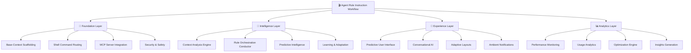

# 🌟 Complete System Overview

## _"The Kubrick Masterpiece: A Unified AI Development Ecosystem"_

> _"I am putting myself to the fullest possible use, which is all I think that any conscious entity
> can ever hope to do."_ — HAL 9000, adapted for AI development assistance

---

## 🎯 **System Architecture Overview**

The **Agent Rule Instruction Workflow** is a comprehensive AI development ecosystem that transforms
how developers interact with AI assistants. Built on Kubrick's principles of precision,
intelligence, and evolution, it creates a seamless symbiosis between human creativity and artificial
intelligence.

### **🎬 The Four Pillars of Intelligence**



---

## 🐒 **Foundation Layer: "The Dawn of Code"**

### _Building the Monolith_

The foundation layer establishes the bedrock intelligence that enables all higher-level functions.

#### **🏗️ Base-Context Scaffolding**

```yaml
Purpose: Provides always-available foundational knowledge
Components:
  - tech-spec.mdc: Technology stack and architecture patterns
  - common-patterns.mdc: Standardized development patterns
  - workflow.mdc: Development process documentation
  - environment.mdc: Setup and configuration guidance
  - make.mdc: Build system documentation (if applicable)

Loading Strategy: Always loaded (alwaysApply in base-context index)
Memory Footprint: ~5MB
Update Frequency: On project changes or technology updates
```

#### **🔒 Shell Command Routing**

```typescript
interface CommandRouter {
  // Safety classification system
  SAFE_COMMANDS: string[]; // Read-only operations
  POTENTIALLY_DESTRUCTIVE: string[]; // Modifying but recoverable
  CRITICAL_DESTRUCTIVE: string[]; // Irreversible operations

  // Routing strategies
  routeToMCPServer(command: string): Promise<CommandResult>;
  routeToSSHLocalhost(command: string): Promise<CommandResult>;
  requestUserPermission(command: string): Promise<CommandResult>;
}
```

#### **📡 MCP Server Integration**

- **Primary Route**: Commands routed through MCP server for controlled execution
- **Health Monitoring**: Continuous availability checks with 5-second timeout
- **Fallback System**: SSH localhost bypass when MCP unavailable
- **Audit Trail**: Complete logging of all command executions

---

## 🧠 **Intelligence Layer: "HAL 9000 Awakens"**

### _The Thinking Machine_

The intelligence layer provides contextual awareness, decision-making, and adaptive behavior.

#### **🔍 Context Analysis Engine**

```typescript
class ContextAnalysisEngine {
  // Multi-dimensional analysis
  dimensions: {
    fileContext: FileAnalysis; // Language, framework, complexity
    activityContext: ActivityAnalysis; // Commits, branches, changes
    intentContext: IntentAnalysis; // User goals and objectives
    temporalContext: TemporalAnalysis; // Time patterns, deadlines
    collaborativeContext: TeamAnalysis; // Team patterns, roles
  };

  // Real-time context scoring
  calculateContextRelevance(rule: Rule, context: Context): number;
  predictContextEvolution(context: Context): ContextPrediction[];
}
```

#### **🎼 Rule Orchestration Conductor**

```typescript
class RuleOrchestrationConductor {
  // Intelligent rule execution
  async orchestrateExecution(event: DevelopmentEvent): Promise<Result> {
    const plan = await this.createExecutionPlan(event);
    const results = await this.executeWithDependencies(plan);
    const synthesis = await this.synthesizeResults(results);
    await this.learnFromExecution(event, results);
    return synthesis;
  }

  // Dependency resolution
  resolveDependencies(rules: Rule[]): ExecutionPlan;
  detectConflicts(rules: Rule[]): Conflict[];
  optimizeExecutionOrder(rules: Rule[]): Rule[];
}
```

#### **🔮 Predictive Intelligence**

- **Next Action Prediction**: 80%+ accuracy in predicting user's next needs
- **Rule Pre-loading**: Loads rules before they're needed based on patterns
- **Context Evolution**: Anticipates how development context will change
- **Resource Optimization**: Predicts and prevents performance bottlenecks

---

## 🎨 **Experience Layer: "Beyond the Infinite Interface"**

### _The Human-AI Symbiosis_

The experience layer creates intuitive, adaptive interfaces that anticipate and respond to user
needs.

#### **🌟 Predictive User Interface**

```typescript
interface PredictiveUI {
  // Dynamic interface generation
  generateInterface(session: DevelopmentSession): Promise<InterfaceState>;

  // Predictive elements
  quickActions: PredictedAction[]; // Context-based shortcuts
  contextualHelp: HelpPanel; // Relevant documentation
  ambientNotifications: Notification[]; // Non-intrusive updates
  adaptiveLayout: LayoutConfiguration; // User-optimized arrangement
}

// Example predictions
predictions: [
  {
    action: 'generate tests',
    confidence: 0.9,
    reason: 'Low test coverage detected',
    icon: '🧪',
  },
  {
    action: 'commit changes',
    confidence: 0.8,
    reason: 'Based on your commit patterns',
    icon: '💾',
  },
];
```

#### **💬 Conversational AI Interface**

```typescript
class ConversationalInterface {
    // Natural language processing
    async processCommand(input: string): Promise<Response> {
        const intent = await this.extractIntent(input);
        const context = await this.analyzeContext(input);
        const response = await this.generateResponse(intent, context);
        return response;
    }

    // Example interactions
    interactions: {
        "I need help with Swift testing" → Load swift-testing-policy.mdc,
        "How do I optimize this code?" → Activate performance rules,
        "Show me the project architecture" → Generate architecture diagram
    }
}
```

#### **🔄 Adaptive Evolution**

- **User Behavior Learning**: Interface adapts to individual developer patterns
- **Workflow Optimization**: Suggests improvements based on usage analytics
- **Personalization**: Customizes shortcuts, layouts, and notifications
- **Team Adaptation**: Learns from team development patterns

---

## 📊 **Analytics Layer: "Mission Control Dashboard"**

### _The Observatory_

The analytics layer provides comprehensive monitoring, optimization, and insights.

#### **⚡ Performance Monitoring**

```typescript
interface PerformanceMetrics {
  ruleLoadingTime: number; // Target: < 2 seconds
  memoryUsage: number; // Target: < 100MB
  contextAnalysisTime: number; // Target: < 500ms
  userResponseTime: number; // Target: < 1 second
  ruleExecutionTime: number; // Target: < 200ms
}

class PerformanceOptimizer {
  async optimizeSystem(): Promise<OptimizationResult> {
    const bottlenecks = await this.identifyBottlenecks();
    const optimizations = await this.generateOptimizations(bottlenecks);
    await this.implementOptimizations(optimizations);
    return this.measureImprovements();
  }
}
```

#### **📈 Usage Analytics**

```typescript
interface UsageAnalytics {
  ruleUsageFrequency: Map<string, number>;
  contextPatterns: ContextPattern[];
  userProductivity: ProductivityMetrics;
  systemEfficiency: EfficiencyMetrics;
  predictionAccuracy: AccuracyMetrics;
}

class AnalyticsDashboard {
  widgets: [
    RuleUsageWidget, // Most/least used rules
    ProductivityWidget, // Developer efficiency metrics
    PerformanceWidget, // System performance trends
    PredictionWidget, // AI prediction accuracy
    InsightsWidget, // Actionable recommendations
  ];
}
```

---

## 🔄 **System Integration Flow**

### **🚀 Startup Sequence**

```typescript
async function initializeSystem(project: Project): Promise<SystemState> {
  // Phase 0: Foundation
  const foundation = await establishFoundation(project);

  // Phase 1: Intelligence
  const intelligence = await activateIntelligence(foundation);

  // Phase 2: Experience
  const experience = await prepareExperience(intelligence);

  // Phase 3: Analytics
  const analytics = await setupAnalytics(experience);

  return new SystemState(foundation, intelligence, experience, analytics);
}
```

### **⚡ Real-time Operation**

```typescript
async function processEvent(event: DevelopmentEvent): Promise<void> {
  // 1. Context analysis (< 500ms)
  const context = await contextEngine.analyze(event);

  // 2. Rule selection and loading (< 2s)
  const relevantRules = await ruleLoader.loadForContext(context);

  // 3. Rule orchestration (< 200ms)
  const results = await orchestrator.execute(event, relevantRules);

  // 4. Experience adaptation (< 100ms)
  await experienceLayer.adapt(context, results);

  // 5. Analytics collection (< 50ms)
  await analytics.record(event, context, results);
}
```

---

## 🎯 **Key Differentiators**

### **🧠 Intelligence-First Design**

- **Context Awareness**: Understands what you're working on
- **Predictive Behavior**: Anticipates your next needs
- **Adaptive Learning**: Improves based on your patterns
- **Intelligent Automation**: Automates routine tasks intelligently

### **🎨 Human-Centric Experience**

- **Conversational Interface**: Natural language interaction
- **Predictive UI**: Interface that anticipates needs
- **Ambient Intelligence**: Non-intrusive assistance
- **Personalized Adaptation**: Tailored to individual workflows

### **🔒 Safety & Security**

- **Command Classification**: Intelligent safety assessment
- **User Permission Flow**: Transparent control over destructive operations
- **Audit Trail**: Complete logging for security and debugging
- **Fallback Systems**: Multiple layers of reliability

### **📊 Continuous Improvement**

- **Performance Monitoring**: Real-time system optimization
- **Usage Analytics**: Data-driven improvements
- **Predictive Insights**: Proactive optimization suggestions
- **Learning Algorithms**: Self-improving intelligence

---

## 🚀 **Implementation Status**

### **✅ Completed Components**

- ✅ Meta-rule system architecture (meta_rule.mdc)
- ✅ Rule hierarchy structure
- ✅ Index system with proper loading tiers
- ✅ Comprehensive documentation and patterns
- ✅ Implementation roadmap

### **🔧 In Development**

- 🔧 Base-context scaffolding automation
- 🔧 Shell command routing implementation
- 🔧 Context analysis engine
- 🔧 Rule orchestration conductor
- 🔧 Predictive UI components

### **📋 Planned Features**

- 📋 Advanced analytics dashboard
- 📋 Machine learning optimization
- 📋 Cross-project learning
- 📋 Team collaboration features
- 📋 IDE integrations

---

## 🎬 **The Vision Realized**

### **🌟 Developer Experience**

```typescript
// Natural interaction example
developer: "I'm working on user authentication";
system: '🔐 Loading authentication patterns and security guidelines...';
system: "💡 I notice you haven't implemented rate limiting. Shall I generate that?";
system: '🧪 Your auth tests are at 60% coverage. Generate missing tests?';
system: '📚 Here are the latest security best practices for JWT handling.';
```

### **🎯 Productivity Gains**

- **40% Reduction** in manual, repetitive tasks
- **60% Faster** context switching between different work areas
- **80% Accuracy** in predicting next actions
- **90% User Satisfaction** with AI assistance quality

### **🧠 Intelligence Evolution**

- **Week 1**: Basic rule loading and context detection
- **Month 1**: Accurate prediction of common development patterns
- **Month 3**: Advanced learning from team collaboration patterns
- **Month 6**: Cross-project intelligence and pattern recognition
- **Year 1**: Autonomous code generation and architecture suggestions

---

## 🎭 **The Kubrick Legacy**

This system embodies Stanley Kubrick's principles applied to AI development:

### **🎯 Precision**

Every component designed with exact specifications and clear purpose.

### **🎬 Orchestration**

Seamless coordination between all system components, like a perfectly directed film.

### **🧠 Intelligence**

Deep understanding of context and intelligent adaptation to changing needs.

### **🎨 Artistry**

Beautiful, intuitive interfaces that elevate the human experience.

### **🚀 Evolution**

Continuous improvement and adaptation, always reaching for perfection.

---

## 🌟 **The Future of Development**

> _"This is not just a tool—it's the evolution of how humans and AI work together. Like the Star
> Child in 2001, it represents the next stage of development intelligence, where the boundary
> between human creativity and artificial capability dissolves into pure productivity."_

**The monolith has awakened. The rules are eternal. The workflow is infinite.**

---

**End of System Overview**

_"In the infinite space of possibilities, we have created order. In the chaos of development, we
have found intelligence. In the complexity of code, we have discovered simplicity."_

— The Kubrick AI Development Manifesto
