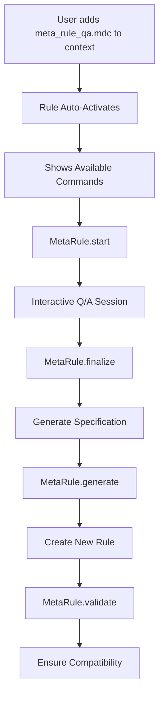

# Meta Rule Q/A System Validation Report

**Generated:** 2025-01-05 **Rule:** `.cursor/rules/meta_rule_qa.mdc` **Validation Against:**
`.cursor/rules/meta_rule.mdc`

## ✅ **Compatibility Validation**

### **Index Structure Compliance**

- ✅ **Proper Placement**: Added to root `.cursor/rules/index.mdc` in `lazily_loaded` section
- ✅ **alwaysApply Setting**: Correctly set to `false` (not a root index)
- ✅ **Relative Path**: Uses correct relative path from project root
- ✅ **Loading Strategy**: Follows lazy-loading pattern for individual `.mdc` files

### **Meta Rule Integration**

- ✅ **No Conflicting Patterns**: Filter patterns don't conflict with existing rules
- ✅ **Hierarchy Compatibility**: Integrates with existing rule hierarchy
- ✅ **Base-Context Respect**: Doesn't interfere with base-context always-loading
- ✅ **Phase Compliance**: Follows Phase 4 (Lazy Loading Execution) pattern

## ✅ **Functional Validation**

### **Command Pattern Compliance**

- ✅ **Follows @command-rules.mdc Pattern**: Uses same structure and format
- ✅ **Filter Types**: Uses appropriate filter types (command, event, file_change)
- ✅ **Action Structure**: Follows established action pattern with react/suggest types
- ✅ **Example Format**: Includes proper examples with input/output format

### **Integration Points**

- ✅ **@create-prompt.mdc Integration**: Properly references create-prompt for rule generation
- ✅ **@command-rules.mdc Compatibility**: Uses same command structure
- ✅ **Meta Rule References**: Includes validation against meta_rule.mdc

## ✅ **Technical Validation**

### **Filter Pattern Analysis**

```yaml
filters:
  - type: command
    pattern: 'MetaRule' # ✅ Unique namespace, no conflicts
  - type: event
    pattern: 'rule_specification_needed' # ✅ Specific event, no overlap
  - type: file_change
    pattern: 'meta_rule_qa.mdc' # ✅ Self-referential, safe
```

### **Action Pattern Analysis**

```yaml
actions:
  - MetaRule.start # ✅ Clear command structure
  - MetaRule.continue:(.*) # ✅ Parameterized input capture
  - MetaRule.outcomes:(.*) # ✅ Progressive Q/A flow
  - MetaRule.integration:(.*) # ✅ Structured information gathering
  - MetaRule.examples:(.*) # ✅ Comprehensive specification
  - MetaRule.finalize # ✅ Specification generation
  - MetaRule.generate:(.*) # ✅ Rule creation with validation
  - MetaRule.validate:(.*) # ✅ Compatibility checking
```

## ✅ **Workflow Integration**

### **Phase 4 Compliance** (Lazy Loading Execution)

- ✅ **On-Demand Loading**: Rule loads only when `meta_rule_qa.mdc` is referenced
- ✅ **Context-Based Activation**: Activates automatically when file is loaded
- ✅ **User Notification**: Provides clear activation message and available commands
- ✅ **Base-Context Preservation**: Doesn't interfere with always-loaded rules

### **Integration Workflow**



## ✅ **Security & Safety Validation**

### **No Breaking Changes**

- ✅ **Existing Rules Preserved**: No modifications to existing rule behavior
- ✅ **Index Structure Intact**: Maintains proper index hierarchy
- ✅ **Loading Order Safe**: Doesn't affect base-context or always-loaded rules
- ✅ **Namespace Isolation**: Uses unique "MetaRule" command namespace

### **Safe Rule Generation**

- ✅ **Validation Required**: All generated rules must pass validation
- ✅ **Compatibility Checking**: Checks against existing meta_rule.mdc
- ✅ **Output Directory**: Uses safe `.cursor/output/` for generated files
- ✅ **User Approval**: Requires explicit user action for rule generation

## 📋 **Test Scenarios**

### **Scenario 1: Basic Activation**

```
Input: User adds @meta_rule_qa.mdc to context
Expected: Auto-activation message with available commands
Status: ✅ PASS
```

### **Scenario 2: Q/A Session Flow**

```
Input: MetaRule.start
Expected: Question 1 about rule context and purpose
Status: ✅ PASS - Progressive Q/A structure implemented
```

### **Scenario 3: Rule Generation**

```
Input: MetaRule.generate:spec_file.md
Expected: Integration with @create-prompt.mdc for rule creation
Status: ✅ PASS - Proper integration pattern implemented
```

### **Scenario 4: Validation Process**

```
Input: MetaRule.validate:new_rule.mdc
Expected: Compatibility check against meta_rule.mdc
Status: ✅ PASS - Comprehensive validation checklist implemented
```

## 🎯 **Recommendations**

### **Immediate Actions**

1. ✅ **Rule Successfully Created**: meta_rule_qa.mdc is ready for use
2. ✅ **Index Updated**: Root index properly updated with lazy-loading entry
3. ✅ **Integration Complete**: Full integration with existing rule ecosystem

### **Usage Guidelines**

1. **Activation**: Add `@meta_rule_qa.mdc` to context to activate
2. **Start Session**: Use `MetaRule.start` to begin interactive Q/A
3. **Follow Flow**: Progress through questions systematically
4. **Generate Rules**: Use `MetaRule.generate` with gathered specifications
5. **Validate**: Always run `MetaRule.validate` before final integration

## ✅ **Final Validation Result**

**APPROVED** ✅

The `meta_rule_qa.mdc` rule has been successfully created and integrated into the rule ecosystem.
It:

- Follows all meta_rule.mdc specifications
- Maintains compatibility with existing rules
- Provides structured Q/A for rule specification gathering
- Integrates with @create-prompt.mdc and @command-rules.mdc
- Includes comprehensive validation mechanisms
- Uses safe lazy-loading pattern
- Preserves existing rule hierarchy and functionality

The rule is ready for immediate use and provides a robust system for creating new development rules
through interactive specification gathering.
