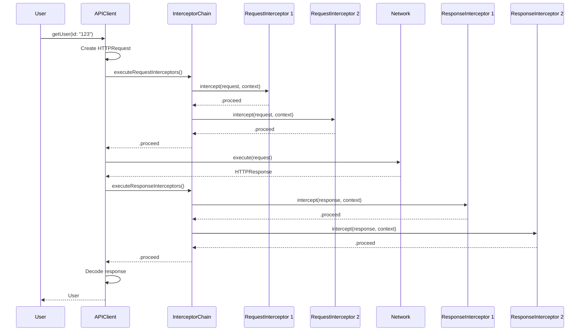
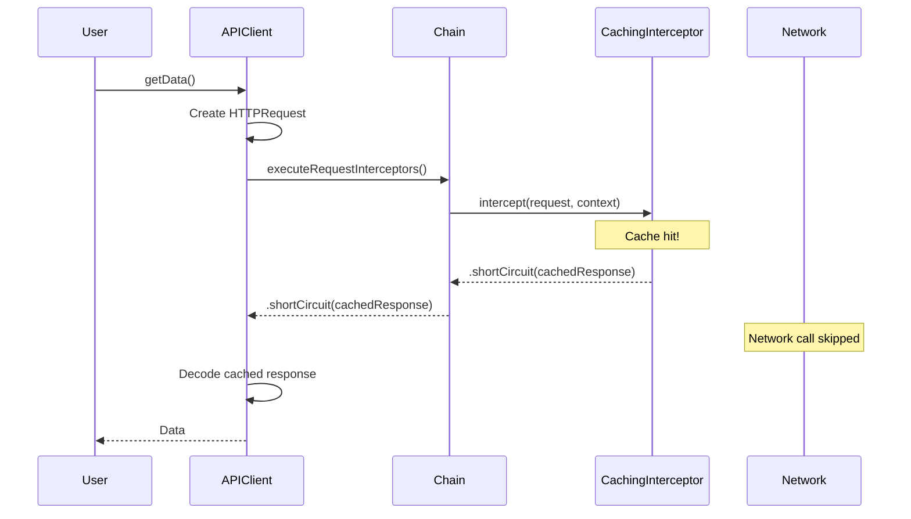
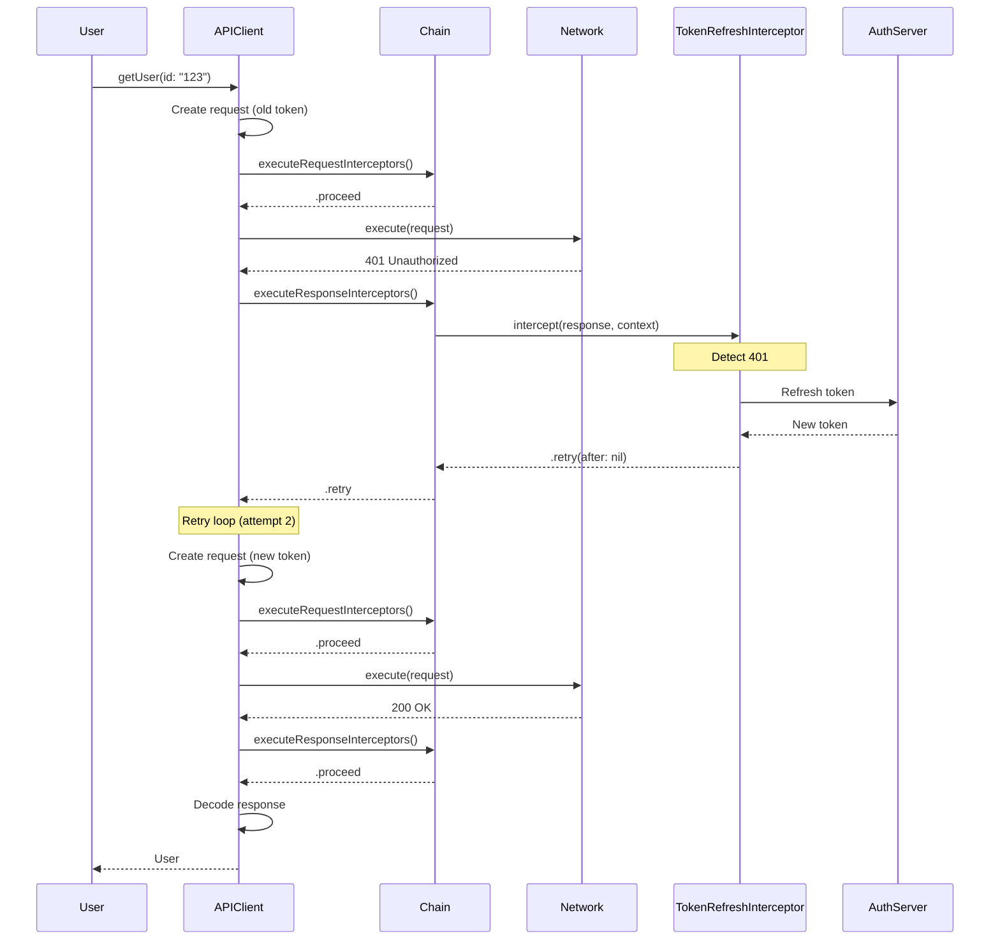

# Design Document: Request/Response Interceptors

## Architectural Decisions

### ADR-001: Protocol-Based Interceptor Design

**Decision**: Use separate `RequestInterceptor` and `ResponseInterceptor` protocols instead of a single unified interceptor interface.

**Rationale**:
- **Single Responsibility Principle**: Request concerns (auth, headers) are distinct from response concerns (caching, retry)
- **Type Safety**: Prevents runtime errors from calling wrong interceptor type
- **Composability**: Developers can implement one or both protocols as needed
- **Performance**: Skip unused interceptor phases (no request interceptors = skip request phase)

**Alternatives Considered**:
1. **Single Interceptor Protocol**: Would require optional methods, reducing type safety
2. **Class-Based Middleware**: Violates Swift 6 Sendable requirements and adds reference counting overhead

**Trade-offs**:
- More protocols to learn, but clearer separation of concerns
- Slightly more code, but better compile-time guarantees

### ADR-002: Sequential Execution Model

**Decision**: Execute interceptors sequentially in registration order, not in parallel.

**Rationale**:
- **Determinism**: Predictable execution order for debugging
- **State Dependency**: Later interceptors may depend on earlier ones (e.g., logging after auth)
- **Simplicity**: Easier to reason about than parallel execution with synchronization
- **Retry Logic**: Sequential model simplifies retry with modified context

**Alternatives Considered**:
1. **Parallel Execution**: Would require complex synchronization and could break dependencies
2. **Priority-Based Execution**: Adds complexity and makes order non-obvious

**Trade-offs**:
- Sequential execution adds latency (sum of interceptor times), but individual interceptors should be <1ms
- Parallel execution would require developers to handle race conditions

### ADR-003: InterceptorResult Enum for Control Flow

**Decision**: Use `InterceptorResult` enum with `.proceed`, `.shortCircuit(HTTPResponse)`, and `.retry(after: Duration?)` cases.

**Rationale**:
- **Explicit Intent**: Clear what each interceptor wants to happen next
- **Type Safety**: Compiler enforces handling all cases
- **Short-Circuit Support**: Cache can return response without network call
- **Retry Support**: Token refresh can trigger retry after refresh succeeds

**Alternatives Considered**:
1. **Boolean Return**: Too limited, can't express short-circuit or retry
2. **Throwing Errors**: Would abort chain, can't express short-circuit
3. **Callback-Based**: Adds complexity and breaks structured concurrency

**Trade-offs**:
- Enum pattern is more code than boolean, but infinitely more expressive
- Retry loop must be handled by chain executor, not individual interceptors

### ADR-004: Macro-Generated Chain Initialization

**Decision**: `@Interceptors` macro generates interceptor chain initialization code in the implementation struct's `init()`.

**Rationale**:
- **Compile-Time Safety**: Interceptor types validated during macro expansion
- **Zero Runtime Reflection**: All wiring done at compile-time
- **Sendable Compliance**: All interceptors must be Sendable, enforced by compiler
- **Performance**: No dynamic lookup or runtime registration overhead

**Alternatives Considered**:
1. **Runtime Registration**: Would require global registry, breaks Sendable, adds overhead
2. **Builder Pattern**: More flexible but loses compile-time safety

**Trade-offs**:
- Macro complexity increases, but users get simpler API
- Changing interceptors requires recompilation, but that's acceptable for this use case

### ADR-005: Context-Based Metadata Passing

**Decision**: Use `InterceptorContext` struct to pass metadata (path, method, attemptCount) to interceptors.

**Rationale**:
- **Extensibility**: Can add new context fields without breaking existing interceptors
- **Sendable**: Struct with Sendable fields is automatically Sendable
- **Immutability**: Context is created per-request, preventing shared mutable state
- **Clarity**: All context data in one place, not scattered across parameters

**Alternatives Considered**:
1. **Individual Parameters**: Would require changing all interceptor signatures to add new context
2. **Dictionary-Based**: Less type-safe, no compile-time checking

**Trade-offs**:
- Struct allocation overhead, but context is small and short-lived
- May contain unused fields for some interceptors, but memory cost is negligible

### ADR-006: Retry Loop Ownership

**Decision**: `InterceptorChain` owns the retry loop logic, not individual interceptors or HTTP method macros.

**Rationale**:
- **Centralized Logic**: Retry logic in one place, easier to test and debug
- **Max Attempts Enforcement**: Chain tracks total attempts across all interceptors
- **Short-Circuit Handling**: Chain can distinguish retry from short-circuit
- **Consistency**: All HTTP methods get same retry behavior automatically

**Alternatives Considered**:
1. **Interceptor-Owned Retry**: Would require each retry interceptor to implement loop logic
2. **Macro-Generated Retry**: Would duplicate retry code in every generated method

**Trade-offs**:
- Chain becomes more complex, but interceptors become simpler
- Retry loop in chain means interceptors can't customize retry logic per-interceptor (acceptable trade-off)

### ADR-007: Fast-Path Optimization for Zero Interceptors

**Decision**: When no `@Interceptors` annotation exists, generate identical code to Phase 5.2 (no interceptor overhead).

**Rationale**:
- **Backward Compatibility**: Existing code has zero performance regression
- **Opt-In Philosophy**: Interceptors are additive, not mandatory
- **Performance**: Zero overhead for users who don't need interceptors

**Implementation**:
```swift
// Phase 5.2 code (no @Interceptors)
public func getUser(id: String) async throws -> User {
  let path = "/users/\(id)"
  var request = HTTPRequest(method: .GET, path: path, baseURL: baseURL)
  let response = try await client.execute(request)
  return try JSONDecoder().decode(User.self, from: response.data)
}

// Phase 6 code (with @Interceptors)
public func getUser(id: String) async throws -> User {
  let path = "/users/\(id)"
  var request = HTTPRequest(method: .GET, path: path, baseURL: baseURL)
  let context = InterceptorContext(path: path, method: .GET, attemptCount: 0)

  let requestResult = try await interceptors.executeRequestInterceptors(
    request: &request, context: context
  )
  guard case .proceed = requestResult else { /* handle short-circuit */ }

  var response = try await client.execute(request)

  let responseResult = try await interceptors.executeResponseInterceptors(
    response: response, context: context
  )

  return try JSONDecoder().decode(User.self, from: response.data)
}
```

**Trade-offs**:
- More macro complexity to detect presence of `@Interceptors`
- Code duplication between paths, but keeps zero-interceptor case optimal

## Data Flow Diagrams

### Request Flow with Interceptors



### Short-Circuit Flow (Cache Hit)



### Retry Flow (Token Refresh)



## Component Architecture

```mermaid
graph TB
    subgraph "Macro Layer"
        API[@API Macro]
        INT[@Interceptors Macro]
        GET[@GET Macro]
    end

    subgraph "Runtime Layer"
        CHAIN[InterceptorChain]
        RPROTO[RequestInterceptor Protocol]
        SPROTO[ResponseInterceptor Protocol]
    end

    subgraph "Implementations"
        AUTH[AuthenticationInterceptor]
        LOG[LoggingInterceptor]
        RETRY[RetryInterceptor]
        CACHE[CachingInterceptor]
    end

    API --> INT
    INT --> CHAIN
    GET --> CHAIN
    CHAIN --> RPROTO
    CHAIN --> SPROTO
    RPROTO -.implements.- AUTH
    RPROTO -.implements.- LOG
    SPROTO -.implements.- LOG
    SPROTO -.implements.- RETRY
    RPROTO -.implements.- CACHE
    SPROTO -.implements.- CACHE
```

## Error Handling Strategy

### InterceptorError Hierarchy

```swift
public enum InterceptorError: Error, Sendable {
  case maxRetriesExceeded(maxAttempts: Int)
  case interceptorFailed(underlyingError: Error)
  case invalidResult(reason: String)
}
```

### Error Propagation

1. **Interceptor Throws Error**: Wrapped in `InterceptorError.interceptorFailed`, chain execution aborts
2. **Max Retries Exceeded**: Chain throws `InterceptorError.maxRetriesExceeded` after N attempts
3. **Invalid Result**: Chain validates result (e.g., short-circuit with nil response), throws `InterceptorError.invalidResult`

### User-Facing Errors

All `InterceptorError` cases provide `localizedDescription` with actionable information:
- "Maximum retry attempts (3) exceeded for request to /users/123"
- "Interceptor 'AuthenticationInterceptor' failed: Token provider returned nil"
- "Invalid interceptor result: Short-circuit response cannot be nil"

## Performance Characteristics

### Time Complexity

- **Zero Interceptors**: O(1) - identical to Phase 5.2
- **N Request Interceptors**: O(N) sequential execution
- **M Response Interceptors**: O(M) sequential execution
- **Retry with R attempts**: O(R * (N + M + network_time))

### Space Complexity

- **InterceptorChain**: O(N + M) to store interceptor arrays
- **InterceptorContext**: O(1) - fixed-size struct
- **Retry Loop**: O(R) - context mutation for attempt tracking

### Benchmark Targets

| Operation | Target | Measurement |
|-----------|--------|-------------|
| Single interceptor execution | <1ms | Per interceptor overhead |
| Chain with 10 interceptors | <10ms | Total chain overhead |
| Zero interceptor case | 0ms | Must be identical to Phase 5.2 |
| Context creation | <0.1ms | Per request |
| Short-circuit detection | <0.1ms | Cache lookup |

## Security Considerations

### Sendable Compliance

All interceptor types must be `Sendable`:
- Prevents data races across actor boundaries
- Enforced at compile-time by Swift 6 strict concurrency
- Interceptors cannot hold mutable shared state

### Token Security

`AuthenticationInterceptor` example will demonstrate:
- Never log tokens in `LoggingInterceptor`
- Store tokens in Keychain (via `tokenProvider`)
- Clear expired tokens immediately
- Use secure transport (HTTPS) enforced by `NetworkClient`

### Header Injection Prevention

`InterceptorChain` will validate:
- No CRLF injection in header values
- No duplicate `Authorization` headers (last wins)
- All headers validated by existing `HeaderSecurityMiddleware`

### Retry Attack Mitigation

`RetryInterceptor` will implement:
- Exponential backoff to prevent thundering herd
- Max attempts cap (default: 3)
- Retry only on idempotent methods (GET, PUT, DELETE, not POST)
- Jitter to distribute retries

## Testing Strategy

### Unit Test Coverage (Target: 90%)

- `InterceptorChain`: Sequential execution, short-circuit, retry, error propagation
- `RequestInterceptor`: Request modification, context usage
- `ResponseInterceptor`: Response inspection, retry triggering
- Each common interceptor: Auth, logging, retry, cache, rate-limit

### Integration Test Coverage (Target: 95%)

- Macro expansion with `@Interceptors` annotation
- Generated code compilation with real interceptors
- Multiple HTTP methods with interceptors
- Configuration macros (`@DefaultHeaders`) with interceptors

### End-to-End Test Coverage (Target: 100%)

- Full flow: auth + logging + retry with mock `NetworkClient`
- Token refresh: 401 → refresh → retry → success
- Cache: request → miss → network → hit
- Retry: failure → backoff → success

## Future Extensions

### Conditional Interceptors (Phase 6.4)

Add optional `shouldIntercept()` methods:

```swift
public protocol RequestInterceptor: Sendable {
  func shouldIntercept(request: HTTPRequest) -> Bool // Optional, default true
  func intercept(request: inout HTTPRequest, context: InterceptorContext) async throws -> InterceptorResult
}
```

Use cases:
- Auth interceptor only for `/api/*` paths
- Logging interceptor only for non-GET requests
- Cache interceptor only for specific endpoints

### Async Interceptor Initialization (Future)

Some interceptors may need async setup (e.g., loading cache from disk):

```swift
@Interceptors([
  await CachingInterceptor.load(from: .disk),
  LoggingInterceptor()
])
```

Requires async `init()` support in implementation struct (Swift 6 proposal).

### Interceptor Composition (Future)

Allow interceptors to compose other interceptors:

```swift
struct SecurityInterceptor: RequestInterceptor {
  private let auth: AuthenticationInterceptor
  private let rateLimiter: RateLimitInterceptor

  func intercept(request: inout HTTPRequest, context: InterceptorContext) async throws -> InterceptorResult {
    try await auth.intercept(request: &request, context: context)
    return try await rateLimiter.intercept(request: &request, context: context)
  }
}
```

Enables reusable interceptor bundles for common patterns.

## References

- [Swift Concurrency](https://docs.swift.org/swift-book/documentation/the-swift-programming-language/concurrency/)
- [SwiftSyntax Documentation](https://github.com/swiftlang/swift-syntax)
- [Networking Framework Phase 5.2](../../specs/001-api-client-macro/plan.md)
- [OWASP Top 10](https://owasp.org/www-project-top-ten/)
- [Swift Macros WWDC 2023](https://developer.apple.com/videos/play/wwdc2023/10166/)
