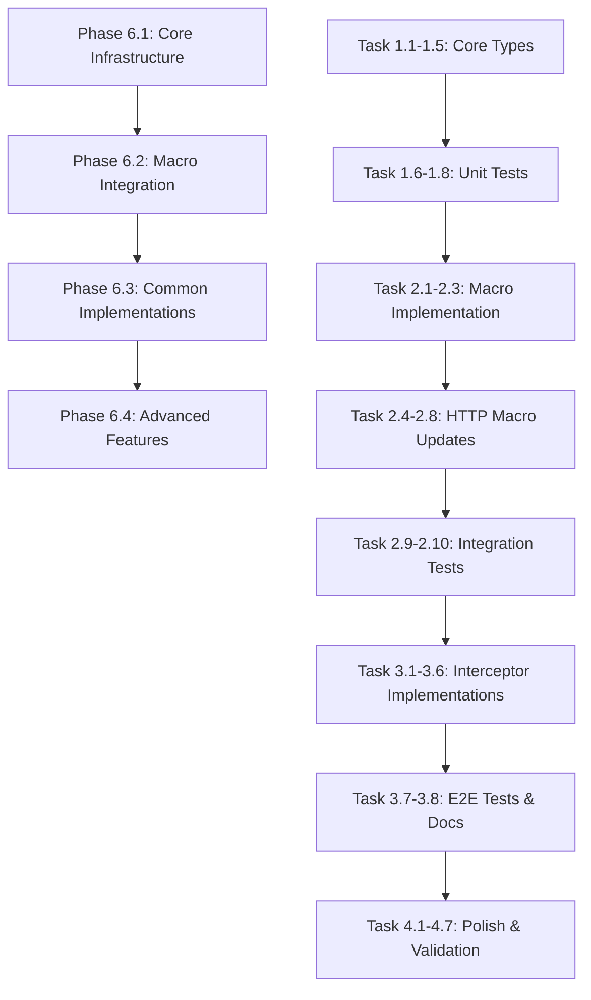

# Implementation Tasks: Add Request/Response Interceptors

## Phase 6.1: Core Interceptor Infrastructure ✅ COMPLETE

### Task 1.1: Define Interceptor Protocols ✅

- [x] Create `Sources/Networking/Interceptors/InterceptorProtocols.swift`
- [x] Define `RequestInterceptor` protocol with `intercept(request:context:)` method
- [x] Define `ResponseInterceptor` protocol with `intercept(response:context:)` method
- [x] Mark both protocols as `Sendable` for Swift 6 compliance
- [x] Add comprehensive DocC documentation with examples

**Verification**: ✅ Compile Sources/Networking module without errors

### Task 1.2: Create InterceptorContext ✅

- [x] Create `Sources/Networking/Interceptors/InterceptorContext.swift`
- [x] Add properties: `path`, `method`, `attemptCount`, `metadata`
- [x] Mark as `Sendable` struct
- [x] Add initializer and documentation

**Verification**: ✅ Compile Sources/Networking module without errors

### Task 1.3: Create InterceptorResult Enum ✅

- [x] Create `Sources/Networking/Interceptors/InterceptorResult.swift`
- [x] Define cases: `proceed`, `shortCircuit(HTTPResponse)`, `retry(after: TimeInterval?)`
- [x] Mark as `Sendable` enum
- [x] Add documentation for each case

**Verification**: ✅ Compile Sources/Networking module without errors
**Note**: Used `TimeInterval` instead of `Duration` due to availability constraints

### Task 1.4: Implement InterceptorChain ✅

- [x] Create `Sources/Networking/Interceptors/InterceptorChain.swift`
- [x] Add properties for `requestInterceptors` and `responseInterceptors` arrays
- [x] Implement `executeRequestInterceptors(request:context:)` async method
- [x] Implement `executeResponseInterceptors(response:context:)` async method
- [x] Add retry loop logic with max attempts handling
- [x] Mark as `Sendable` struct

**Verification**: ✅ Compile Sources/Networking module without errors

### Task 1.5: Define InterceptorError ✅

- [x] Create `Sources/Networking/Interceptors/InterceptorError.swift`
- [x] Define cases: `maxRetriesExceeded`, `interceptorFailed(Error)`, `invalidResult`
- [x] Conform to `Error` and `Sendable`
- [x] Add localized descriptions with `LocalizedError` conformance

**Verification**: ✅ Compile Sources/Networking module without errors

### Task 1.6: Unit Tests for InterceptorChain ✅

- [x] Create `Tests/NetworkingTests/Interceptors/InterceptorChainTests.swift`
- [x] Test sequential execution order of request interceptors
- [x] Test sequential execution order of response interceptors
- [x] Test short-circuit behavior (interceptor returns cached response)
- [x] Test retry logic with max attempts
- [x] Test error propagation from interceptors
- [x] Test empty interceptor chain (no-op behavior)

**Verification**: ✅ `swift test --filter InterceptorChainTests` passes (16 tests)

### Task 1.7: Unit Tests for Request Interceptors ✅

- [x] Create `Tests/NetworkingTests/Interceptors/RequestInterceptorTests.swift`
- [x] Test request modification (adding headers)
- [x] Test request inspection without modification
- [x] Test context usage (attempt count, metadata)
- [x] Test async interceptor execution
- [x] Test Sendable compliance

**Verification**: ✅ `swift test --filter RequestInterceptorTests` passes (12 tests)

### Task 1.8: Unit Tests for Response Interceptors ✅

- [x] Create `Tests/NetworkingTests/Interceptors/ResponseInterceptorTests.swift`
- [x] Test response inspection
- [x] Test response replacement (cache hit scenario)
- [x] Test retry triggering on specific conditions
- [x] Test context usage
- [x] Test Sendable compliance

**Verification**: ✅ `swift test --filter ResponseInterceptorTests` passes (15 tests)

**Phase 6.1 Summary**: 43 tests passing, all Swift 6 Sendable compliant, full DocC documentation

## Phase 6.2: Macro Integration

### Task 2.1: Implement @Interceptors Macro

- [ ] Create `Sources/NetworkingMacros/Interceptors/InterceptorsMacro.swift`
- [ ] Define `InterceptorsMacro` conforming to `PeerMacro`
- [ ] Extract interceptor types from macro arguments
- [ ] Validate interceptor types at compile-time
- [ ] Add diagnostic messages for invalid usage

**Verification**: Compile NetworkingMacros module without errors

### Task 2.2: Modify APIMacro for Interceptor Support

- [ ] Read `Sources/NetworkingMacros/API/APIMacro.swift`
- [ ] Add logic to detect `@Interceptors` attribute on protocol
- [ ] Extract interceptor types from `@Interceptors` annotation
- [ ] Generate `private let interceptors: InterceptorChain` property
- [ ] Generate interceptor chain initialization in `init(client:)`
- [ ] Pass interceptor array to `InterceptorChain` initializer

**Verification**: Compile NetworkingMacros module without errors

### Task 2.3: Create InterceptorCodeGenerator

- [ ] Create `Sources/NetworkingMacros/Interceptors/InterceptorCodeGenerator.swift`
- [ ] Add `generateRequestInterceptorHook(context:)` method
- [ ] Add `generateResponseInterceptorHook(context:)` method
- [ ] Generate context creation code
- [ ] Generate interceptor chain execution code
- [ ] Generate short-circuit handling code

**Verification**: Compile NetworkingMacros module without errors

### Task 2.4: Update GETMacro for Interceptors

- [ ] Read `Sources/NetworkingMacros/HTTP/GETMacro.swift`
- [ ] Add request interceptor hook after request initialization
- [ ] Add response interceptor hook after client.execute()
- [ ] Add retry loop support
- [ ] Maintain existing functionality (path params, query params, headers)

**Verification**: Compile NetworkingMacros module without errors

### Task 2.5: Update POSTMacro for Interceptors

- [ ] Read `Sources/NetworkingMacros/HTTP/POSTMacro.swift`
- [ ] Add request interceptor hook after request initialization
- [ ] Add response interceptor hook after client.execute()
- [ ] Add retry loop support
- [ ] Maintain existing functionality (body, path params, query params, headers)

**Verification**: Compile NetworkingMacros module without errors

### Task 2.6: Update PUTMacro for Interceptors

- [ ] Read `Sources/NetworkingMacros/HTTP/PUTMacro.swift`
- [ ] Add request interceptor hook
- [ ] Add response interceptor hook
- [ ] Add retry loop support

**Verification**: Compile NetworkingMacros module without errors

### Task 2.7: Update PATCHMacro for Interceptors

- [ ] Read `Sources/NetworkingMacros/HTTP/PATCHMacro.swift`
- [ ] Add request interceptor hook
- [ ] Add response interceptor hook
- [ ] Add retry loop support

**Verification**: Compile NetworkingMacros module without errors

### Task 2.8: Update DELETEMacro for Interceptors

- [ ] Read `Sources/NetworkingMacros/HTTP/DELETEMacro.swift`
- [ ] Add request interceptor hook
- [ ] Add response interceptor hook
- [ ] Add retry loop support

**Verification**: Compile NetworkingMacros module without errors

### Task 2.9: Macro Expansion Tests with Interceptors

- [ ] Create `Tests/NetworkingTests/Macros/InterceptorMacroTests.swift`
- [ ] Test @API with @Interceptors generates interceptor chain property
- [ ] Test @API with @Interceptors initializes chain in init()
- [ ] Test @GET with interceptors generates hook code
- [ ] Test @POST with interceptors generates hook code
- [ ] Test multiple interceptors in chain
- [ ] Test empty interceptor chain

**Verification**: `swift test --filter InterceptorMacroTests` passes

### Task 2.10: Integration Tests with Real Interceptors

- [ ] Update `Tests/NetworkingTests/Macros/MacroIntegrationTests.swift`
- [ ] Add test: @API + @Interceptors + @GET with auth interceptor
- [ ] Add test: Multiple HTTP methods with logging interceptor
- [ ] Add test: Interceptor order enforcement (auth before logging)
- [ ] Verify all 83 existing macro tests still pass

**Verification**: `swift test --filter MacroIntegrationTests` passes AND `swift test --filter ".*MacroTests"` shows 100+ tests passing

## Phase 6.3: Common Interceptor Implementations

### Task 3.1: AuthenticationInterceptor

- [ ] Create `specs/002-request-response-interceptors/contracts/AuthenticationInterceptor.swift`
- [ ] Implement `RequestInterceptor` protocol
- [ ] Accept `tokenProvider` in initializer
- [ ] Add `Authorization: Bearer <token>` header to requests
- [ ] Add unit tests

**Verification**: `swift test --filter AuthenticationInterceptorTests` passes

### Task 3.2: LoggingInterceptor

- [ ] Create `specs/002-request-response-interceptors/contracts/LoggingInterceptor.swift`
- [ ] Implement both `RequestInterceptor` and `ResponseInterceptor`
- [ ] Log request method, path, headers
- [ ] Log response status, headers, body size
- [ ] Add configurable log levels
- [ ] Add unit tests

**Verification**: `swift test --filter LoggingInterceptorTests` passes

### Task 3.3: TokenRefreshInterceptor

- [ ] Create `specs/002-request-response-interceptors/contracts/TokenRefreshInterceptor.swift`
- [ ] Implement `ResponseInterceptor` protocol
- [ ] Detect 401 status codes
- [ ] Call token refresh endpoint
- [ ] Return `.retry()` after successful refresh
- [ ] Add unit tests with mock token provider

**Verification**: `swift test --filter TokenRefreshInterceptorTests` passes

### Task 3.4: CachingInterceptor

- [ ] Create `specs/002-request-response-interceptors/contracts/CachingInterceptor.swift`
- [ ] Implement both `RequestInterceptor` and `ResponseInterceptor`
- [ ] Check cache in request interceptor, return `.shortCircuit()` on hit
- [ ] Store response in cache in response interceptor
- [ ] Add TTL support
- [ ] Only cache GET requests
- [ ] Add unit tests

**Verification**: `swift test --filter CachingInterceptorTests` passes

### Task 3.5: RetryInterceptor

- [ ] Create `specs/002-request-response-interceptors/contracts/RetryInterceptor.swift`
- [ ] Implement `ResponseInterceptor` protocol
- [ ] Detect retryable errors (5xx, network failures)
- [ ] Implement exponential backoff calculation
- [ ] Return `.retry(after: duration)`
- [ ] Respect max attempts from context
- [ ] Add unit tests

**Verification**: `swift test --filter RetryInterceptorTests` passes

### Task 3.6: RateLimitInterceptor

- [ ] Create `specs/002-request-response-interceptors/contracts/RateLimitInterceptor.swift`
- [ ] Implement `RequestInterceptor` protocol
- [ ] Track request timestamps
- [ ] Delay request if rate limit exceeded
- [ ] Add configurable rate limits (requests per second/minute)
- [ ] Add unit tests

**Verification**: `swift test --filter RateLimitInterceptorTests` passes

### Task 3.7: End-to-End Integration Tests

- [ ] Create `Tests/NetworkingTests/Interceptors/E2EInterceptorTests.swift`
- [ ] Test full flow: auth + logging + retry with mock NetworkClient
- [ ] Test token refresh flow: 401 → refresh → retry → success
- [ ] Test cache flow: request → cache miss → network → cache hit
- [ ] Test retry with backoff: failure → retry → success

**Verification**: `swift test --filter E2EInterceptorTests` passes

### Task 3.8: Quickstart Documentation

- [ ] Create `specs/002-request-response-interceptors/quickstart.md`
- [ ] Add "Getting Started" section with basic example
- [ ] Document each common interceptor with code examples
- [ ] Add "Combining Interceptors" section
- [ ] Add "Creating Custom Interceptors" section
- [ ] Add troubleshooting guide

**Verification**: Manual review of documentation completeness

## Phase 6.4: Advanced Features & Polish

### Task 4.1: Conditional Interceptor Support

- [ ] Add `shouldIntercept(request:)` optional method to `RequestInterceptor`
- [ ] Add `shouldIntercept(response:)` optional method to `ResponseInterceptor`
- [ ] Update `InterceptorChain` to check conditions before execution
- [ ] Add path pattern matching support
- [ ] Add HTTP method filtering support
- [ ] Add unit tests

**Verification**: `swift test --filter ConditionalInterceptorTests` passes

### Task 4.2: Performance Optimization

- [ ] Add fast-path for zero interceptors (skip chain initialization)
- [ ] Minimize allocations in hot path (reuse context objects)
- [ ] Avoid copying large request/response bodies
- [ ] Add performance benchmarks
- [ ] Measure <1ms overhead per interceptor
- [ ] Measure zero overhead for zero interceptors

**Verification**: `swift test --filter PerformanceBenchmarkTests` passes with <1ms per interceptor

### Task 4.3: DocC Documentation

- [ ] Add interceptor guide to `Sources/Networking/Networking.docc/`
- [ ] Document `RequestInterceptor` protocol with examples
- [ ] Document `ResponseInterceptor` protocol with examples
- [ ] Document `InterceptorChain` execution model
- [ ] Add "Common Interceptor Patterns" article
- [ ] Add "Custom Interceptor Development" tutorial

**Verification**: `swift package generate-documentation` succeeds, manual review of docs

### Task 4.4: Example App

- [ ] Create example app demonstrating interceptor patterns
- [ ] Show auth interceptor with real token provider
- [ ] Show logging interceptor with console output
- [ ] Show retry interceptor with simulated failures
- [ ] Show caching interceptor with visual cache hit indicator
- [ ] Add README with usage instructions

**Verification**: Example app builds and runs successfully

### Task 4.5: Stress Testing

- [ ] Create stress tests with 20+ interceptors
- [ ] Test high request volume (1000+ concurrent requests)
- [ ] Test retry loops with circuit breaker
- [ ] Test memory usage under load
- [ ] Test thread safety with concurrent requests

**Verification**: `swift test --filter StressTests` passes without crashes or memory leaks

### Task 4.6: Update CHANGELOG

- [ ] Add Phase 6.1-6.4 entries to CHANGELOG.md
- [ ] Document all new interceptor types
- [ ] Document API additions (protocols, chain, result types)
- [ ] Document breaking changes (none expected)
- [ ] Document migration path (opt-in via @Interceptors)

**Verification**: Manual review of CHANGELOG completeness

### Task 4.7: Final Validation

- [ ] Run all tests: `swift test`
- [ ] Verify test count increased by ~50+ tests
- [ ] Verify test coverage ≥90% for interceptor code
- [ ] Run SwiftLint: `swiftlint lint`
- [ ] Run swift-format: `swift-format lint --recursive Sources/ Tests/`
- [ ] Verify no compiler warnings
- [ ] Verify no failing tests

**Verification**: All validation commands pass

## Task Dependencies

## Verification Summary

| Phase | Tasks | Verification Command |
|-------|-------|---------------------|
| 6.1 | 1.1-1.5 | `swift build` |
| 6.1 | 1.6-1.8 | `swift test --filter "Interceptor.*Tests"` |
| 6.2 | 2.1-2.3 | `swift build` |
| 6.2 | 2.4-2.8 | `swift build` |
| 6.2 | 2.9-2.10 | `swift test --filter ".*MacroTests"` |
| 6.3 | 3.1-3.6 | `swift test --filter "*InterceptorTests"` |
| 6.3 | 3.7 | `swift test --filter E2EInterceptorTests` |
| 6.4 | 4.1-4.2 | `swift test --filter "Conditional.*\|Performance.*"` |
| 6.4 | 4.7 | `swift test && swiftlint lint` |
